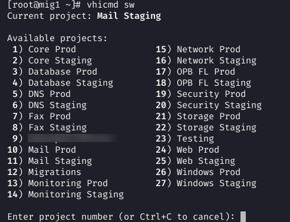
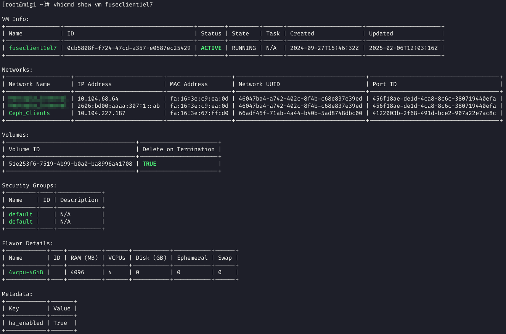

# vhicmd

A command-line utility for interacting with VHI (Virtuozzo Hybrid Infrastructure) APIs. This tool provides a streamlined interface for managing virtual machines, volumes, networks, images, and other resources in VHI environments. vhicmd requires no external dependencies (VDDK, virt-v2v, nbdcopy, etc) - it handles the entire migration process by leveraging the Virtuozzo API.

```bash
Usage:
  vhicmd [command]

Available Commands (aliases):
  add                                 Add relationships between resources
  auth                                Get an authentication token from VHI.
  bootable                            Set the bootable flag for a volume
  catalog (cat)                       Fetch and display the OpenStack service catalog
  completion                          Generate the autocompletion script for the specified shell
  config (cfg | conf)                 Manage vhicmd configuration
  create (new)                        Create resources like VMs or volumes
  delete (rm | del)                   Delete resources
  details (show)                      Show details of resources
  download (dl)                       Download resources
  help                                Help about any command
  hosts                               List compute hosts and their details
  list (ls)                           List various objects in OpenStack/VHI (domains, projects, etc.)
  migrate (mig)                       Migrate resources from VMWare to VHI
  netboot                             Configure netboot settings
  pause                               Pause a VM
  reboot                              Reboot a virtual machine
  switch-project (sw)                 Switch to a different project using saved credentials
  unpause                             Unpause a VM
  update (set)                        Update resource attributes
  usage                               Show resource usage statistics
  validate                            Validate and preview a template with provided variables
  version (v)                         Print build information

Flags:
      --config string   Config file (default is $HOME/.vhirc)
      --debug           Enable debug mode
  -h, --help            help for vhicmd
  -H, --host string     VHI host to connect to
      --rc string       RC directory for config and token (overrides VHICMD_RCDIR)

Use "vhicmd [command] --help" for more information about a command.
```

## Features

- Authentication and project management
- Resource listing (VMs, volumes, networks, flavors, images, ports)
- Detailed resource information
- VM creation, deletion, and management
- Volume creation and management
- Network and port management
- Image management and sharing
- VM migration from VMware environments
- Templating support for cloud-init scripts and bash scripts

## Build & Installation

```bash
make
cd bin && mv vhicmd /usr/local/bin
```

## RC Directory

For shared systems or when you need to use different configurations, you can specify an RC directory:

```bash
# Set for current session
export VHICMD_RCDIR=/path/to/rc/dir

# Or use --rc flag
vhicmd --rc /path/to/rc/dir <command>
```

This will store the config file (`.vhirc`) and token in the specified directory instead of the default `~/.vhirc`. This is useful for:
- Preventing collisions on shared systems
- Using different configurations for different environments
- Running commands as different users

## Configuration

vhicmd uses a configuration file located at `~/.vhirc` (YAML format).

Example configuration:
```yaml
host: panel-vhi1.yourhost.com
domain: yourdomain
project: yourproject
username: youruser
password: yourpassword
networks: uuid1,uuid2
flavor_id: flavor-uuid
image_id: image-uuid
```

Configuration Options:
- `host`: VHI host URL
- `domain`: VHI domain
- `project`: VHI project
- `username`: VHI username
- `password`: VHI password
- `networks`: Default networks for VM creation (CSV, optional)
- `flavor_id`: Default flavor for VM creation (optional)
- `image_id`: Default image for VM creation (optional)

Manage configuration:
```bash
vhicmd config list                # Show current config
vhicmd config get <key>           # Get specific value
vhicmd config set <key> <value>   # Set specific value
```

## Authentication

```bash
# Using config file values
vhicmd auth

# Interactive authentication with prompts
vhicmd auth <domain> <project> --host <vhi host>

# Command line authentication
vhicmd auth <domain> <project> -u username -p password

# Switch between projects
vhicmd switch-project [project]   # Interactive if no project specified
```


## Resource Management Commands

### Basic Operations

View service catalog:
```bash
vhicmd catalog [--interface public|admin|internal]
```

List resources:
```bash
vhicmd list domains              # Admin only
vhicmd list projects
vhicmd list vms [--name filter]                                        # Shows IPs and power state
vhicmd list volumes
vhicmd list networks [--name filter]
vhicmd list ports [--status DOWN] [--name filter] [--mac-address addr]  # Shows all ports by default
vhicmd list flavors
vhicmd list images [--name filter] [--visibility public|private|shared]
vhicmd list image-members <image>
```

Get detailed information:
```bash
vhicmd details vm <vm-id>
vhicmd details volume <volume-id>
vhicmd details image <image-id>
vhicmd details port <port-id>
```



Download resources:
```bash
vhicmd download image <image-id> [--output path]
vhicmd download volume <volume-id> [--output path]
```

Manage VM state:
```bash
vhicmd pause <vm-id>            # Pause VM
vhicmd unpause <vm-id>          # Unpause VM
vhicmd reboot soft <vm-id>      # Soft reboot
vhicmd reboot hard <vm-id>      # Hard reboot
```

View usage information:
```bash
vhicmd usage                    # Show resource usage
```

### Virtual Machine Management

Create VM:
```bash
vhicmd create vm --name <name> \
  --flavor <flavor-id> \
  --image <image-id> \
  --networks <network-ids> \
  --ips <ip-addresses> \
  --size <size-GB> \
  --user-data <cloud-init-file> \
  --macaddr <mac-addresses>
```

With templates (inline variables):
```bash
vhicmd create vm --name <name> \
  --flavor <flavor-id> \
  --image <image-id> \
  --networks <network-ids> \
  --ips <ip-addresses> \
  --user-data <template-file> \
  --ci-data 'key:value,key:value'
```

With templates (variables from file, useful for multi-line values like PEM certs):
```bash
vhicmd create vm --name <name> \
  --flavor <flavor-id> \
  --image <image-id> \
  --networks <network-ids> \
  --ips <ip-addresses> \
  --user-data <template-file> \
  --ci-data-file vars.txt
```

With pre-created ports:
```bash
vhicmd create vm --name <name> \
  --flavor <flavor-id> \
  --image <image-id> \
  --ports <port-id1>,<port-id2>
```

Delete VM:
```bash
vhicmd delete vm <vm-id>
```

Update VM:
```bash
vhicmd update vm name <vm-id> <new-name>
vhicmd update vm metadata <vm-id> <key> <value>
```

Attach volume:
```bash
vhicmd update vm attach-volume <vm-id> <volume-id>
vhicmd update vm detach-volume <vm-id> <volume-id>
```

Manage VM flavor:
```bash
vhicmd update vm flavor start <vm-id> <new-flavor>     # Start flavor change
vhicmd update vm flavor confirm <vm-id>                # Confirm change
vhicmd update vm flavor revert <vm-id>                 # Revert change
```

Reboot VM:
```bash
vhicmd reboot soft <vm-id>
vhicmd reboot hard <vm-id>
```

Network interfaces:
```bash
vhicmd update vm attach-port <vm-id> <port-id>
vhicmd update vm detach-port <vm-id> <port-id>
```

### Template Support

The templating engine supports variable substitution in cloud-init scripts and bash scripts using the `{}` syntax. Variables are provided via `--ci-data` (inline) or `--ci-data-file` (from file) in `key:value` format.

Validate template:
```bash
vhicmd validate <template-file> --ci-data 'key:value,key:value' [--preview]
```

Template Features:
- Simple `{}` syntax
- Strict validation of all variables
- Support for quoted values with commas
- Newline or comma-delimited key-value pairs
- `--ci-data-file` for file-based variables (supports multi-line quoted values, ideal for PEM certificates)
- Preview mode to see processed output
- Automatic validation before VM creation

#### Bash Script Template Example

```bash
#!/bin/bash
# Set hostname and create user
hostnamectl set-hostname {}
useradd -m -s /bin/bash {}
echo "{} ALL=(ALL) NOPASSWD:ALL" > /etc/sudoers.d/{}

# Configure SSH key
mkdir -p /home/{}/.ssh
echo "{}" > /home/{}/.ssh/authorized_keys
chmod 700 /home/{}/.ssh
chmod 600 /home/{}/.ssh/authorized_keys
chown -R {}:{} /home/{}/.ssh
```

Deploy with:
```bash
vhicmd create vm --name server1 --flavor medium --image ubuntu-22.04 \
  --networks net1 --ips 10.0.0.5 --user-data template.sh \
  --ci-data 'hostname:server1,username:admin,ssh_key:ssh-rsa AAAA...'
```

#### Cloud-Init YAML Template Example

```yaml
#cloud-config
hostname: {}
users:
  - name: {}
    ssh_authorized_keys:
      - {}
    sudo: ALL=(ALL) NOPASSWD:ALL
    shell: /bin/bash

package_update: true
packages:
  - {}
```

Deploy with:
```bash
vhicmd create vm --name web1 --flavor medium --image ubuntu-22.04 \
  --networks net1 --ips 10.0.0.6 --user-data template.yaml \
  --ci-data 'hostname:web1,username:admin,ssh_key:ssh-rsa AAAA...,packages:nginx curl'
```

### Storage Management

Create volume:
```bash
vhicmd create volume --name <name> \
  --size <size-GB> \
  --type <volume-type> \
  --description <description>
```
Delete volume:
```bash
vhicmd delete volume <volume-id>
```

Manage bootable flag:
```bash
vhicmd bootable <volume-id> true|false
```

### Image Management

Create image:
```bash
vhicmd create image --file <path> \
  --name <name> \
  [--format qcow2|raw|vmdk|iso]
```

Delete image:
```bash
vhicmd delete image <image-id>
```

Image sharing:
```bash
vhicmd add image-member <image> <project-id>      # Grant access
vhicmd delete image-member <image> <project-id>   # Revoke access
vhicmd update image member <image> <member-id> <status>  # Update member status
vhicmd update image visibility <image> <visibility>       # Update visibility
```

### Network Management

Create port:
```bash
vhicmd create port --network <network-id> [--mac <mac-address>] [--name <port-name>] [--ip <ip-address>]
```

Delete port:
```bash
vhicmd delete port <port-id-name-or-mac>   # Accepts UUID, name, or MAC address
```

### VM Migration

Migrate from VMware:
```bash
vhicmd migrate vm \
  --name <name> \
  --vmdk <path> \
  --flavor <flavor> \
  --networks <networks> \
  --mac <mac-addresses> \
  --size <size-GB> \
  [--disk-bus sata|scsi|virtio] \
  [--secondary-vmdk <path>]
```

Find VMDK files:
```bash
vhicmd migrate find <pattern> [--single]
```

The migration process supports:
- Automatic conversion of VMware VMDK to KVM-compatible format
- Primary VMDK as boot disk
- Optional secondary VMDK that will be attached as an additional volume
- Network interface preservation with MAC addresses
- Unmanaged networks in VHI

## Global Flags

- `-H, --host`: Override the VHI host
- `--config`: Specify alternate config file
- `--debug`: Enable debug mode
- `--json`: Output in JSON format (available for list/details commands)

## Notes

- Most commands accept either resource IDs or names
- `vhicmd` supports networks with IPAM disabled which allows manually specifying MAC addresses as a normal user when creating a port
- When using templates, all variables in the template must be provided in the ci-data parameter
- Template validation strictly enforces that all variables are accounted for


